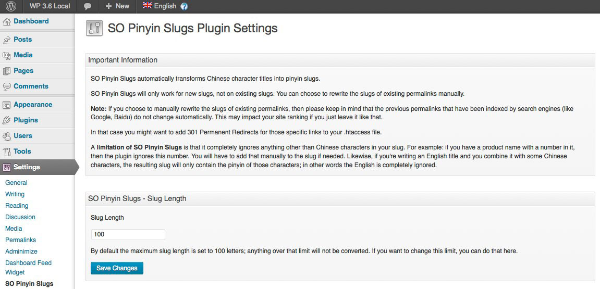
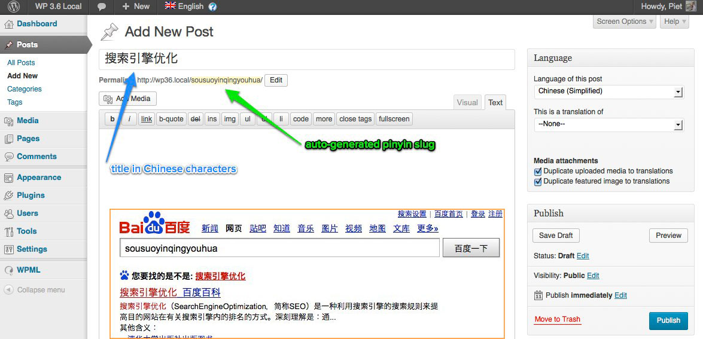

# SO Pinyin Slugs

###### Last updated on 2016.11.29
###### tested up to WP 4.7
###### Authors: [Piet Bos](https://github.com/senlin), [Denis Cao](https://github.com/caoyongsheng)
###### [Stable Version](https://wordpress.org/plugins/so-pinyin-slugs) (via WordPress Plugins Repository)
###### [Plugin homepage](https://so-wp.com/?p=17)

WordPress plugin that transforms Chinese character titles (of Posts, Pages and all other content types that use slugs) into a permalink friendly slug, showing pinyin that can be read by humans and (Chinese) search engines alike.

## Description

The SO Pinyin Slugs plugin is a fork of the original [Pinyin Permalinks](https://wordpress.org/plugins/pinyin-permalink/) plugin by user [xiaole_tao](https://profiles.wordpress.org/xiaole_tao/) who has seemingly abandoned his plugin as he never responded to emails.

The original plugin can basically only be used on Chinese only websites; as soon as you install it on a bi/multilingual site it messes up the slugs of the non-Chinese languages.

This fork has been adapted by my ex-colleague [Denis Cao](https://github.com/caoyongsheng) in such a way that the slugs of the non-Chinese language remain untouched and only the Chinese character slugs will be transformed into pinyin.

Chinese characters don't come out good in permalinks. Without the SO Pinyin Slugs plugin activated, the example post I made for the screenshot will get a slug like this: *%e6%90%9c%e7%b4%a2%e5%bc%95%e6%93%8e%e4%bc%98%e5%8c%96*. With the plugin the slug automatically becomes *sousuoyinqingyouhua*. 

Search engines such as [Baidu](https://www.baidu.com) obviously cannot make much of the first slug, but they can handle pinyin perfectly, especially when it is written as one long string without hyphens or underscores. 

So instead of transforming "中国" into two separate words divided by a hyphen or an underscore (the original plugin has this as options), it is best transformed into "zhongguo". The only option SO Pinyin Slugs therefore has left is the length that you can limit to an x amount of letters. The default is 100, which should be plenty for most.

## WPML Compatible

The SO Pinyin Slugs plugin has received the [WPML Certification of Compatibility](https://wpml.org/plugin/so-pinyin-slugs/).

## Frequently Asked Questions

### Known Issues:

* SO Pinyin Slugs will not transform existing slugs

### Can I use this plugin also for Traditional Chinese?

No, the dictionary part of the plugin only contains Simplified Chinese. If you want, you can check what words the dictionary contains by going into `inc/dictionary.php`

### I have an issue with this plugin, where can I get support?

Please open an issue here on [Github](https://github.com/senlin/so-pinyin-slugs/issues)

## Contributions

This repo is open to _any_ kind of contributions.

## License

* License: GNU Version 2 or Any Later Version
* License URI: http://www.gnu.org/licenses/gpl-2.0.html

## Donations

* Donate link: https://so-wp.com/plugins/donations

## Connect with me through

[Website](https://bohanintl.com)

[Website](https://so-wp.com)

[Github](https://github.com/senlin) 

[LinkedIn](https://www.linkedin.com/in/pietbos) 

[WordPress](https://profiles.wordpress.org/senlin/) 

## Changelog

### 2.1.1 (2016.11.29)

* remove version check
* tested up to WP 4.7

### 2.1.0 (2016.03.10)

* fix to not ignore alphanumerical characters by [vanabel](https://github.com/vanabel), closes [issue #4](https://github.com/senlin/so-pinyin-slugs/issues/4)

### 2.0.4 (2015.08.07)

* TWEAK: header settings page; only showed half logo after 2.0.3 update 

### 2.0.3 (2015.08.05)

* changed header settings page to h1 (https://make.wordpress.org/plugins/2015/08/03/4-3-change-to-plugin-dashboard-pages/)
* show 4.3 compatibility

### 2.0.2 (2015.06.19)

* revert to [semantic versioning](http://semver.org/)

### 2.0.1 (2015.04.09)

* changed logos
* new banner image for WP.org Repo by [Joschko Hammermann](https://unsplash.com/hmmrmnn)

### 2.0.0 (2014.07.29)

* due to non-compatibility issues with WP 4.0, complete rewrite of the plugin from the ground up
* bump minimum required WP version up to 3.8

### 1.0.1 (2013.12.28)

* fix reported [bug](https://github.com/senlin/so-pinyin-slugs/issues/1) that causes entire admin to be a maximum width of 48rem

### 1.0.0 (2013.12.26)

* tested up to WP 3.9-alpha
* settings page overhaul to better match WP 3.8 style
* change version number format
* change links  

### 0.1.3

* change text domain to prepare for language packs (via Otto - http://otto42.com/el) 

### 0.1.2

* redo version check
* change Github link
* add Dutch language files
* add WPML accreditation

### 0.1.1

* separate dictionary.php file
* add Mandarin Chinese language files
* edit readme.txt and readme.md
* fix textdomain issue

### 0.1

* First stable release

## Screenshots

Preview of settings page as well as when adding a new Post

---

